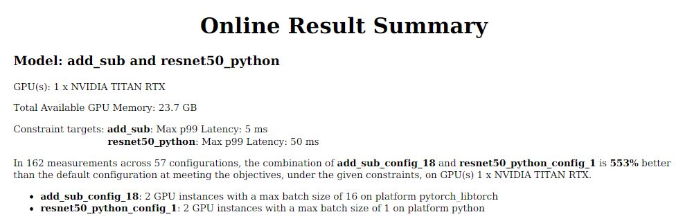

<!--
Copyright (c) 2020-2023, NVIDIA CORPORATION & AFFILIATES. All rights reserved.

Licensed under the Apache License, Version 2.0 (the "License");
you may not use this file except in compliance with the License.
You may obtain a copy of the License at

    http://www.apache.org/licenses/LICENSE-2.0

Unless required by applicable law or agreed to in writing, software
distributed under the License is distributed on an "AS IS" BASIS,
WITHOUT WARRANTIES OR CONDITIONS OF ANY KIND, either express or implied.
See the License for the specific language governing permissions and
limitations under the License.
-->

# Multi-Model Quick Start

The steps below will guide you through using Model Analyzer in Docker mode to profile and analyze two models concurrently: `add_sub` & `resnet50_python`.

## `Step 1:` Download the models

---

**1. Create a new directory and enter it**

```
mkdir <new_dir> && cd <new_dir>
```

**2. Start a git repository**

```
git init && git remote add -f origin https://github.com/triton-inference-server/model_analyzer.git
```

**3. Enable sparse checkout, and download the examples directory, which contains the add_sub & resnet50_python models**

```
git config core.sparseCheckout true && \
echo 'examples' >> .git/info/sparse-checkout && \
git pull origin main
```

## `Step 2:` Pull and Run the SDK Container

---

**1. Pull the SDK container:**

```
docker pull nvcr.io/nvidia/tritonserver:25.11-py3-sdk
```

**2. Run the SDK container**

```
docker run -it --gpus all \
      -v /var/run/docker.sock:/var/run/docker.sock \
      -v $(pwd)/examples/quick-start:$(pwd)/examples/quick-start \
      --net=host nvcr.io/nvidia/tritonserver:25.11-py3-sdk
```

## `Step 3:` Profile both models concurrently

---

The [examples/quick-start](../examples/quick-start) directory is an example
[Triton Model Repository](https://github.com/triton-inference-server/server/blob/main/docs/user_guide/model_repository.md) that contains two libtorch models: `add_sub` & `resnet50_python`

Run the Model Analyzer `profile` subcommand inside the container with:

```
model-analyzer profile \
    --model-repository <path-to-examples-quick-start> \
    --profile-models add_sub,resnet50_python --triton-launch-mode=docker \
    --output-model-repository-path <path-to-output-model-repo>/<output_dir> \
    --export-path profile_results \
    --run-config-profile-models-concurrently-enable
```

**Important:** You must specify an `<output_dir>` subdirectory. You cannot have `--output-model-repository-path` point directly to `<path-to-output-model-repo>`

**Important:** If you already ran this earlier in the container, you can use the `--override-output-model-repository` option to overwrite the earlier results.

**Important**: All models must be in the same repository

---

The `--run-config-profile-models-concurrently-enable` option tells Model Analyzer to load and optimize both models concurrently using the [Quick Search](config_search.md#quick-search-mode) algorithm.

This will profile both models concurrently finding the maximal throughput gain for both models by iterating across instance group counts and batch sizes. By default, the algorithm is attempting to find the best balance of gains for each model, not the best combined total throughput.

After the quick search completes, Model Analyzer will then sweep concurrencies for the top three configurations and then create a summary report and CSV outputs.

---

Here is an example result summary, run on a TITAN RTX GPU:


You will note that the top model configuration has a lower total combined throughput than the third configuration. However, it does a better job at increasing the total percentage throughput gain versus the other configurations.

For example, comparing the top config `[add_sub_config_10, resnet50_python_config_12]` to the third best `[add_sub_config_5, resnet50_python_config_3]`, you will see that while the decrease in `add_sub` throughput is large (~4600 infer/sec), it represents just a **12.5% decrease** in throughput. This is offset by an increase in `resnet50_python` throughput (~46 infer/sec), which represents an **20% increase** in throughput. Therefore, the `[add_sub_config_10, resnet_python_config_12]` is deemed to be a better configuration by Model Analyzer.

---

The measured data and summary report will be placed inside the
`./profile_results` directory. The directory will be structured as follows.

```
$HOME
  |--- model_analyzer
              |--- profile_results
              .       |--- plots
              .       |      |--- simple
              .       |      |      |--- add_sub,resnet50_python
                      |      |              |--- gpu_mem_v_latency.png
                      |      |              |--- throughput_v_latency.png
                      |
                      |--- results
                      |       |--- metrics-model-inference.csv
                      |       |--- metrics-model-gpu.csv
                      |       |--- metrics-server-only.csv
                      |
                      |--- reports
                              |--- summaries
                              .        |--- add_sub,resnet50_python
                              .                |--- result_summary.pdf
```

## `Optional:` Add constraints

---

In the above results you can see a large (651%) throughput increase, but this comes at the expense of a large increase in latency. By creating a YAML config file we can specify per model latency constraints:

```
profile_models:
  add_sub:
    constraints:
      perf_latency_p99:
        max: 5
  resnet50_python:
    constraints:
      perf_latency_p99:
        max: 50
```

And then re-run with the following command:

```
model-analyzer profile \
    --model-repository <path-to-examples-quick-start> \
    --config-file <path-to-config-file> --triton-launch-mode=docker \
    --output-model-repository-path <path-to-output-model-repo>/<output_dir> \
    --export-path profile_results \
    --run-config-profile-models-concurrently-enable
```

---

Here is an example result summary with the above constraints, run on a TITAN RTX GPU:



Again, you will observe that the top configuration here has a lower total combined throughput than the second or third best configurations. However the total percentage gain is higher due to the large decrease in throughput for the `resnet50_python` model in the other configurations.
