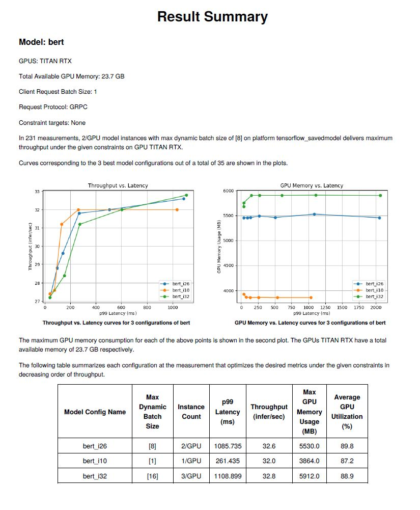

<!--
Copyright (c) 2020, NVIDIA CORPORATION. All rights reserved.

Licensed under the Apache License, Version 2.0 (the "License");
you may not use this file except in compliance with the License.
You may obtain a copy of the License at

    http://www.apache.org/licenses/LICENSE-2.0

Unless required by applicable law or agreed to in writing, software
distributed under the License is distributed on an "AS IS" BASIS,
WITHOUT WARRANTIES OR CONDITIONS OF ANY KIND, either express or implied.
See the License for the specific language governing permissions and
limitations under the License.
-->

# Model Analyzer Reports

The Model analyzer can run inferences with models across multiple parameters. It can also generate reports containing common statistics of interest such as the throughput versus latency curve obtained from these inference runs, as well as the best performing model configuration for each model.

## Requirements

Model Analyzer uses `pdfkit` for report generation. If you are using the recommended docker installation of Model Analyzer, all the necessary components are included. If you are however using other installations, such as running Model Analyzer inside the Triton SDK container, then you will need to download `wkhtmltopdf`.

```
$ sudo apt-get update && sudo apt-get install wkhtmltopdf
```

Once you do this, Model Analyzer will able to use `pdfkit` to generate reports.

## Summary Reports

The most basic type of report is the summary report which the Model Analyzer generates by default for each model. The output directory will, by default, contain 3 subdirectories. The summary report for a model will be located in `[export-path]/reports/<model name>`. The report should look something like the one shown here.



To disable summary report generation use `--summarize=false` or set the `summarize` yaml option to `false`.
